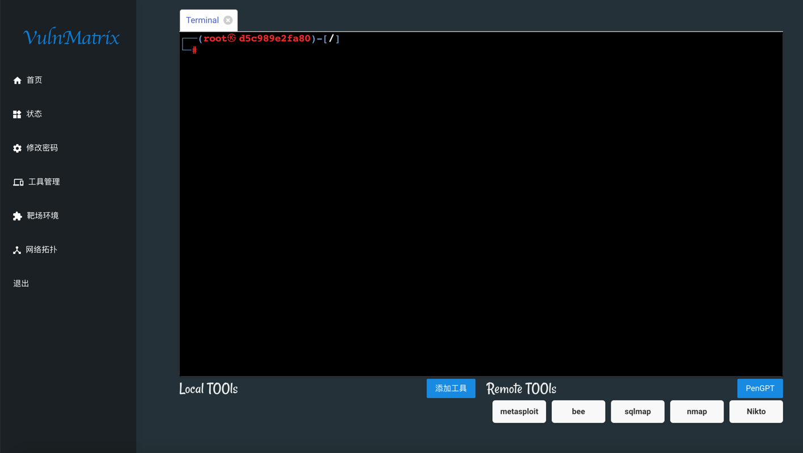
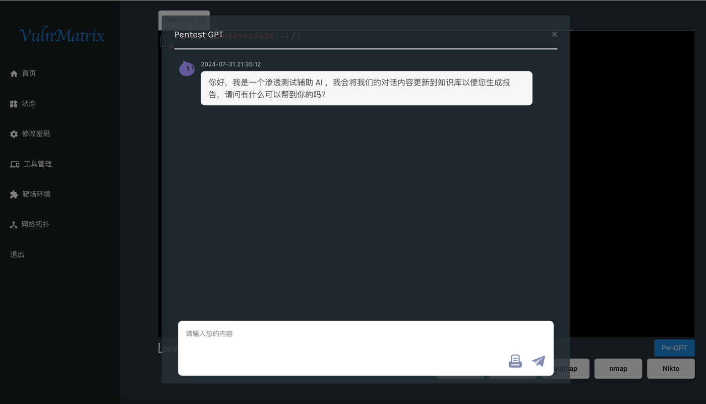

# VulnMatrix
* A Cybersecurity Testing and Verification Range Platform

* 一个综合性靶场平台，可以导入各种Docker漏洞场景和Ctf场景。可以用来部署在私人、公有网络中，以供练习使用。

核心功能设计：

1. 根据docker-compose，生成网络拓扑；

2. 点击生成的靶场弹出新的页面，具有两个视角：

   - 攻击者视角：有一个shell和工具箱；
   - 防御者视角：有目标网络的拓扑……

3. AI辅助渗透
   - 在渗透过程中，可以使用AI辅助渗透，AI会根据当前环境的漏洞情况，给出渗透建议；
   - 最后会生成渗透测试报告，记录本次渗透的过程和结果。


# 环境配置

1、clone项目

```sh 
git clone https://github.com/Legimity/VulnMatrix.git
```

2、安装依赖

``` sh
cd VulnMatrix
pip install -r requirements.txt
```

3、安装docker
```shell
按照官网的教程安装：https://docs.docker.com/engine/install/ubuntu/
```

4、安装sqlit3

``` sh
sudo apt install sqlite3 -y 
```

5、运行

``` sh
python run.py
```

## 主要功能

* 127.0.0.1:8000/login 提供登陆界面：username/passwd：admin/123456，登陆后会进入欢迎页面

  
  

* 点击左边导航栏靶场环境可以查看实验场景，也可以点击右上角“新增环境”导入docker-compose.yml文件

  

* 点击左边导航栏工具管理界面可以查看渗透测试工具

  

* 还可以利用AI辅助渗透测试

  
    
    
